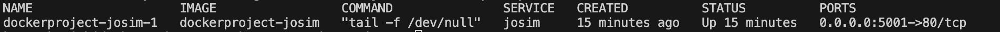

## 概要
- JoSIMの実行環境

## 環境構築方法

 このファイルと同じディレクトリで、次のコマンドを実行

## 

## 1. Dockerイメージのビルドとコンテナの開始

- 以下コマンドで、Dockerfileに記載された設定に基いたDockerイメージをビルド

    `docker-compose up -d`


- 次のコマンドで確認、画像のような出力があれば成功

    `docker-compose ps`

    


## 2. コンテナ内に入る
```
docker-compose exec josim /bin/bash
```

## 3. josimコマンドの実行
```
josim-cli -o ./usrs/test.csv ./usrs/test.cir -V 1
```
ホスト側のJoSIMディレクトリにtest.csvが生成生成されているのを確認する

## Scriptsの有効化
### 仮想環境の有効化
```
python -m venv venv
```
カレントディレクトリにvenvという名前の仮想環境が作成される
```
source venv/bin/activate
```
プロンプトの左の部分に(venv) と表示されたら有効化された状態

仮想環境でのパッケージのインストール
```
pip install -r requirements.txt
```

### スクリプトの実行
```
python scripts/josim-plot.py JoSIM/test.csv -t stacked -c "light"
```
### 仮想環境の終了
```
deactivate
```
venvが消えていることを確認
